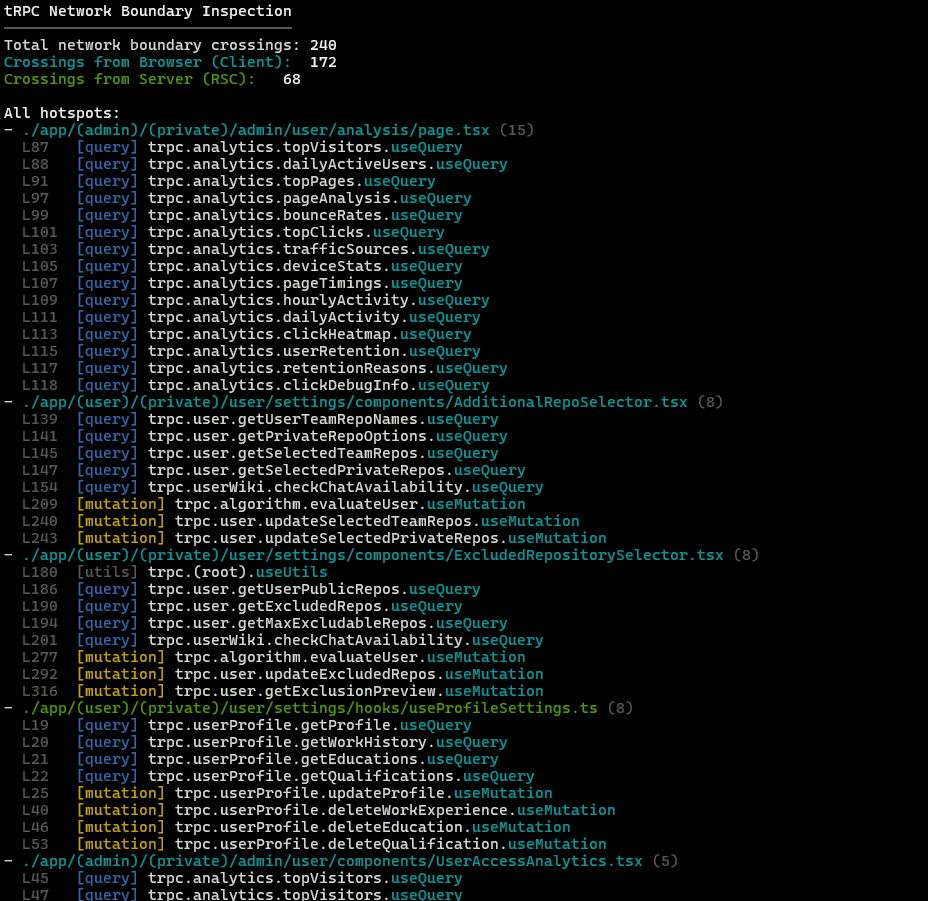

# tRPC Boundary Inspector

Visualize where your tRPC calls cross the network boundary.

`tRPC Boundary Inspector` is a CLI tool that makes tRPC network boundaries visible, especially in Next.js App Router environments. It helps you identify where communication occurs at a glance.

## Features

- **Network Boundary Mapping**: Identify whether tRPC calls are made from the Client, Server (RSC), or Edge Runtime.
- **Call Density Analysis**: See which files are communication hotspots.
- **Detailed Inspection**: Pinpoint exact line numbers, procedure paths, and call types (query, mutation, etc.).
- **CI Friendly**: Generate Markdown reports to track boundary crossings in your Pull Requests.

## Installation

```bash
npm install -g trpc-boundary-inspector
```

## Usage

```bash
# Basic scan
trpc-boundary-inspector .

# Show all hotspots with detailed call locations
trpc-boundary-inspector . --all --details

# Collapse duplicate calls in the same file
trpc-boundary-inspector . --details --collapse

# Ignore specific directories
trpc-boundary-inspector . -I node_modules .next
```

## Output Example



## Why?

tRPC is powerful because it makes server functions feel like local ones. However, this abstraction can lead to:

1.  **Unintended Waterfalls**: Calling multiple `useQuery` hooks during render, causing sequential network requests.
2.  **Boundary Confusion**: Losing track of whether code runs on the server or client, leading to unnecessary communication.
3.  **Runtime Errors**: Accidental calls to Node.js-only procedures from the Edge Runtime.

This tool visualizes the "structure before the accident," supporting healthier architectural decisions.